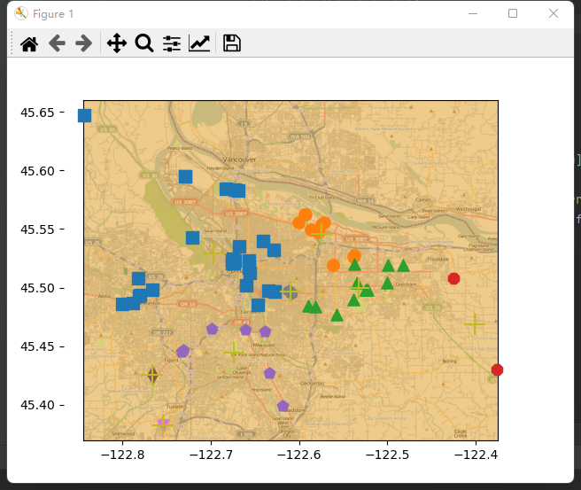
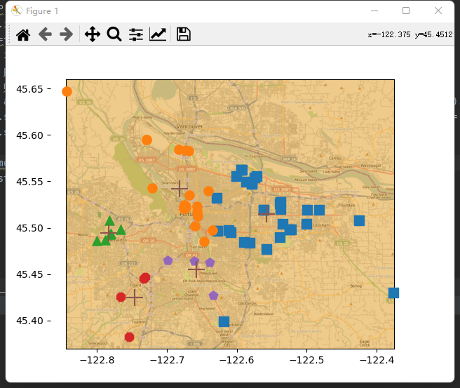

# Clustering

​							

## Introduce：

​		聚类是一种无监督学习。主要是用于分类问题，物以类聚。按照某一个特定的标准（比如距离），把一个数据集分割成不同的类或簇，使得同一个簇内的数据对象的相似性尽可能大，同时不再同一个簇内的数据对象的差异性也尽可能的大。说白了，其实就是把一堆数据按照雷同的程度把他们分开。这里我们介绍K-means聚类方法。

## K-means：

​		K-means聚类。就是一个均值聚类，非常的简单。它的样本雷同的程度是用距离来衡量的。假设现在我们有一个数据集合D，D里面包含n个样本（X<sub>i</sub>），i∈（0，n）。这里的X<sub>i</sub>是一个向量，几维度的向量无所谓，反正它就是一个向量。现在呢？我们想要把这个数据集，划分成k个类别，这个k，就是K-means里面的K，表示的就是要把样本划分为几个类别。那么该怎么办呢？不难想到，既然要划分成k个类别，那么我们需要找到这k个类别的中心点。因为，我们聚类的结果是要这些样本围绕着这个中心展开的。其它样本点到每一个中心的距离，就是我们度量这个样本是属于哪一个类的度量依据。		现在我们来看它的训练过程。从上面的分析我们知道，我们需要找到K个样本的中心：

$$
f(K_i)=M_i(i=0,1,2,3,...,k)
$$

当我们一开始拿到数据的时候其实我们是什么都不知道的，所以这个具体的中心点是很难确定的。不过如果不仔细考究的话，其实也还是很简单的，我们只要随机确定这样的K个中心点就行了。但是中心点对我们最终聚类的结果还是有很大的影响的，所以说需要一个更加合理的方式来确定中心点，这个方式就是K-means++里面提到的方法了。当然如果数据可以可视化的话，并且样本很少画个图出来观察一下也不是不可以。这里我们介绍随机确定中心点，和K-means++确定中心点的方法。

### Center point of Random：

​		额，随机确定，貌似没有什么好说的。就是首先随机得到K个中心点。然后我们，依次求每一个样本点到每一个中心点的距离，样本点距离哪一个中心点更近一点就让这个样本点属于哪一个中心点的类，

$$
X_i∈g({||X_i-M_j(j=0,1,2,3,...,k)||})
$$

这里的g（x）是表示将x映射到对应的一个集合里面。因为有k个类别，所以这里有k个类。接下来，我们就求这K个类中每一个类中所有样本的均值，作为该类的下一个中心点。

$$
CenterPoint_j(j=0,1,2,3,...,k)=\frac{1}{N}\sum_{i=1}^{N}X_i(N为每一个类中元素的个数)
$$

然后就这样一直训练，更新中心点就OK了。当然除了均值，也可以使用中位数作为新的中心点。

### K-means++：

​		这个于上面不同的，只有这个首次中心点的确定。上面的方法首次选择的中心点可能好也可能不好，有很大的不确定性。而对于不确定的事情我们都有一种莫名的恐惧，所以我们需要让这个事情的不确定性减弱。这很容易理解，哪K-means++是怎么样让这个不确定性将下来的呢？它是采取了一种比较直观的感受，就是首次的两个中心点应该在数据集里面，且不同的中心点，他们相差的距离应该大。那么具体的做法是什么？我们接下来来看：首先他会从已有的数据集中随机选取一个点来作为一个中心点。

$$
M_0=random(D)
$$

接下来，根据这个中心点依次去求其他点可能是下一个中心点的概率。这个概率就是依据距离来求的，他是用每一个点到中心点的距离来除以所有点到中心点的距离加和的值，作为该点可能是下一个点发生的概率。当然了，可能是为了方便计算，他这里取了距离的平方来充当距离，不过没关系，因为是一个比值，所以不会对它的结果有什么影响的。

$$
P(x_i)=\frac {||x_i-M_0||^2}{Σ||x_j-M_0||^2(j=0,1,2,3,...,n)}
$$

这样我们找到概率值最大的作为我们的又一个中心点。然后，我们再找下一个中心点，方法也是一样的，不同的是现在我们有了两个中心点，其实也无所谓的啦，上面的一个点到一个点的距离，下面换成，一个点到两个点距离的加和就行了，依次类推，所以我们总的P（x<sub>i</sub>）公式为：

$$
P(x_i)=\frac {Σ||x_i-M_j(j=0,1,2,...,k)||^2}{ΣΣ||x_h-M_j||^2(h=0,1,2,3,...,n)}
$$

这样就可以找到k个相关得到中心点了。接下来步骤和上面就一样了。

### K-CenterPoint：

​		这个算法，其实就是找到了一个度量聚类相对好坏的标准方程。然后通过遍历让这个方程的值最小，因为是遍历，所以最后坑定有一个不动点。这个就是中止条件。它的标准方程是这个样子的：

$$
sum=ΣΣ(||x_i-M_j||^2)
$$


### Deadline：

​		这个上面时候结束，有三种方法，当然可能也有其他的。第一种就是：设置迭代次数。第二种就是寻找中心点的变化率。第三种就是计算每一个样本点到对应中心点距离的加和，这个很容易理解，因为迭代到最后坑定每一个集合的变换都不会太大了，自然的距离加和也就不会太大了，再者说就是最后相同的类坑定我们希望他聚合再一起，所以我们就是找一个最小的距离加和就行了。这里我们还是取距离的平方，减少计算量。

$$
sum=ΣΣ(||x_i-M_j||^2)
$$


## Code：

#### Result:

__k=8__:



__k=5__:



​		从这两幅实验结果的图上对比来看k的取值对于结果的影响来说还是相对较大的，但是，其实吧这个k的取值应该是我们在实际的生产中可以隐约度量的，也不单单说我们看二维图像上的结果好就一定好，往往他是要受到多种外在因素的制约的就像货车的调度，要考虑车型等等，关键还是在初始点的选择上面，可能会对结果的偏差影响非常的大，当然这种无监督学习，也不好去评价具体的好坏，因为没有一个完全的标准。

#### Experience：

​		本次实验实现的这个均值聚类算法，相对来说应该是最为简单的一个算法了，没有啥特别刁钻或者说是难以理解的地方，在此之前的数据挖掘课程实验上已经实现过一次了，相对来说没有什么难度。但是DBSCAN和高斯混合聚类这两个聚类方法要困难一些，不过也没有那么苦难，只是由于期末考试的原因，对他们就不做详细的解释了。本学期所有的课程完美收官，完结撒花。

#### All code：

```python
import matplotlib
import numpy as np
from numpy import *
import matplotlib.pyplot as plt

"""
函数说明：
       文本文件的解析函数
       加载数据集
"""
def loadDataSet(fileName):
    dataMat = []
    fr = open(fileName)
    for line in fr.readlines():
        curLine = line.strip().split('\t')
        fltLine = list(map(float,curLine))
        dataMat.append(fltLine)
    return dataMat


"""
函数说明：
       根据公式返回地球表面两点间的距离
"""
def distSlC(vecA, vecB):
    a = sin(vecA[0,1]*pi/180) * sin(vecB[0,1]*pi/180)
    b = cos(vecA[0,1]*pi/180) * cos(vecB[0,1]*pi/180) * cos((vecB[0,0] - vecA[0,0])*pi/180)
    return arccos(a+b)*6371.0


"""
函数说明：
       为给定数据集构建一个包含k个随机质心的集合
       随机质心必须要在整个数据集的边界之内，可以通过找到数据集每一维的最小和最大值来完成
       创建k个点作为起始质心，可以随机选择(位于数据边界内)
　　当任意一个点的簇分配结果发生改变时
　　　　对数据集中每一个点
　　　　　　　　对每个质心
　　　　　　　　　　计算质心与数据点之间的距离
　　　　　　　　将数据点分配到距其最近的簇
　　　　对每一个簇，计算簇中所有点的均值并将均值作为质心
"""
def randCent(dataSet, k):
    #获取数据集中的坐标维度
    #得到n=2
    n = shape(dataSet)[1]
    #初始化为一个(k,n)的矩阵保存随机生成的k个质心
    centroids = mat(zeros((k,n)))
    #遍历数据集的每一维度
    for j in range(n):
        #获取该列的最小值
        minJ = min(dataSet[:,j])
        #获取该列的最大值
        maxJ = max(dataSet[:,j])
        #得到该列数据的范围(最大值-最小值)
        rangeJ = float(max(dataSet[:,j]) - minJ)
        # k个质心向量的第j维数据值随机为位于(最小值，最大值)内的某一值
        centroids[:,j] = minJ + rangeJ * random.rand(k,1)
    return centroids


""" 
函数说明：
       k-means 聚类算法
       该算法会创建k个质心，然后将每个点分配到最近的质心，再重新计算质心。
       这个过程重复数次，直到数据点的簇分配结果不再改变位置。 
"""
def kMeans(dataSet, k, distMeas=distSlC, createCent=randCent):
    #返回行数
    m = shape(dataSet)[0]
    #创建一个与dataSet行数一样，但是有两列的m*2矩阵，用来保存簇分配结果
    clusterAssment = mat(zeros((m, 2)))
    #createCent=randCent,既然都使用randCent了，那就是创建随机k个质心
    centroids = createCent(dataSet, k)
    #聚类结果是否发生变化的布尔类型
    clusterChanged = True
    while clusterChanged:
        #聚类结果是否发生变化置为false
        clusterChanged = False
        #遍历数据集每一个样本向量
        #循环每一个数据点并分配到最近的质心中去
        for i in range(m):
            #初始化最小距离最正无穷
            minDist = inf
            #最小距离对应索引为-1
            minIndex = -1
            #依次循环k个质心
            for j in range(k):
                #计算某个数据点到质心的距离，欧式距离
                distJI = distMeas(centroids[j,:],dataSet[i,:])
                #如果距离比minDist(最小距离)还小
                if distJI < minDist:
                    #更新minDist(最小距离)和最小质心的index(索引)
                    minDist = distJI
                    minIndex = j
            #当前聚类结果中第i个样本的聚类结果发生变化：
            if clusterAssment[i, 0] != minIndex:
                #布尔类型置为true，继续聚类算法
                clusterChanged = True
                #更新簇分配结果为最小质心的 index（索引），minDist（最小距离）的平方
                clusterAssment[i, :] = minIndex,minDist**2
            #打印k-均值聚类的质心
            print(centroids)
        #遍历每一个质心
        for cent in range(k):
            #获取该簇中的所有点
            #将数据集中所有属于当前质心类的样本通过条件过滤筛选出来
            ptsInClust = dataSet[nonzero(clusterAssment[:, 0].A==cent)[0]]
            #将质心修改为簇中所有点的平均值，mean 就是求平均值的
            #计算这些数据的平均值(axis=0:求列的均值)，作为该类质心向量
            centroids[cent,:] = mean(ptsInClust, axis=0)
    #返回k个聚类，聚类结果与误差
    return centroids, clusterAssment


"""
函数说明：
       二分k-均值聚类算法
"""
def biKmeans(dataSet, k, distMeas=distSlC):
    # 返回行数
    m = shape(dataSet)[0]
    # m x 2 列的矩阵 用来存储每个样本簇系数和误差值
    clusterAssment = mat(zeros((m, 2)))
    # 获取各列的均值
    centroid0 = mean(dataSet, axis=0).tolist()[0]
    # 存储簇质心
    centList = [centroid0]
    # 遍历每个数据样本 返回每个样本到指定簇中心的距离
    for j in range(m):
        # 计算当前聚为一类时各个数据点距离质心的平方距离
        clusterAssment[j, 1] = distMeas(mat(centroid0), dataSet[j, :]) ** 2
    # 循环，直至二分k-均值达到k类为止
    while (len(centList) < k):
        # 将当前最小平方误差置为正无穷
        lowestSSE = inf
        # 遍历当前每个聚类
        for i in range(len(centList)):
            # 通过数组过滤筛选出属于第i类的数据集合
            ptsInCurrCluster = dataSet[nonzero(clusterAssment[:, 0].A == i)[0], :]
            # 对该类利用二分k-均值算法进行划分，返回划分后结果，及误差
            centroidMat, splitClustAss = kMeans(ptsInCurrCluster, 2, distMeas)
            # 计算该类划分后两个类的误差平方和
            sseSplit = sum(splitClustAss[:, 1])
            # 计算数据集中不属于该类的数据的误差平方和
            sseNotSplit = sum(clusterAssment[nonzero(clusterAssment[:, 0].A != i)[0], 1])
            # 划分第i类后总误差小于当前最小总误差
            if (sseSplit + sseNotSplit) < lowestSSE:
                # 第i类作为本次划分类
                bestCentToSplit = i
                # 第i类划分后得到的两个质心向量
                bestNewCents = centroidMat
                # 复制第i类中数据点的聚类结果即误差值
                bestClustAss = splitClustAss.copy()
                # 将划分第i类后的总误差作为当前最小误差
                lowestSSE = sseSplit + sseNotSplit
                # 数组过滤筛选出本次2-均值聚类划分后类编号为1数据点，将这些数据点类编号变为 当前类个数+1，作为新的一个聚类
        bestClustAss[nonzero(bestClustAss[:, 0].A == 1)[0], 0] = len(centList)
        # 同理，将划分数据集中类编号为0的数据点的类编号仍置为被划分的类编号，使类编号连续不出现空缺
        bestClustAss[nonzero(bestClustAss[:, 0].A == 0)[0], 0] = bestCentToSplit
        # 更新质心列表中的变化后的质心向量
        centList[bestCentToSplit] = bestNewCents[0, :].tolist()[0]
        # 添加新的类的质心向量
        centList.append(bestNewCents[1, :].tolist()[0])
        # 更新clusterAssment列表中参与2-均值聚类数据点变化后的分类编号，及数据该类的误差平方
        clusterAssment[nonzero(clusterAssment[:, 0].A == bestCentToSplit)[0], :] = bestClustAss
    # 返回聚类结果
    return mat(centList), clusterAssment


"""
函数说明：
      聚类及簇绘图函数
      打开places.txt文件获取第4列和第5列，分别对应纬度和经度。
      基于这些经纬度对的列表创建一个矩阵。
      在这些数据点上运行biKmeans()
      使用distSLC()函数作为聚类中使用的距离计算方法。
      最后将簇以及簇质心画在图上
"""
def clusterClubs(numClust=5):
    datList = []
    for line in open('places.txt').readlines():
        lineArr = line.split('\t')
        datList.append([float(lineArr[4]), float(lineArr[3])])
    datMat = np.mat(datList)
    myCentroids, clustAssing = biKmeans(datMat, numClust, distMeas=distSlC)
    fig = plt.figure()
    rect=[0.1,0.1,0.8,0.8]
    scatterMarkers=['s', 'o', '^', '8', 'p', \
                    'd', 'v', 'h', '>', '<']
    axprops = dict(xticks=[], yticks=[])
    ax0=fig.add_axes(rect, label='ax0', **axprops)
    #看每个人的文本存在哪里
    imgP = plt.imread(r'.\Portland.png')
    ax0.imshow(imgP)
    ax1=fig.add_axes(rect, label='ax1', frameon=False)
    for i in range(numClust):
        ptsInCurrCluster = datMat[nonzero(clustAssing[:,0].A==i)[0],:]
        markerStyle = scatterMarkers[i % len(scatterMarkers)]
        ax1.scatter(ptsInCurrCluster[:,0].flatten().A[0], ptsInCurrCluster[:,1].flatten().A[0], marker=markerStyle, s=90)
    ax1.scatter(myCentroids[:,0].flatten().A[0], myCentroids[:,1].flatten().A[0], marker='+', s=300)
    plt.show()

if __name__ == '__main__':
    clusterClubs(8)
```
